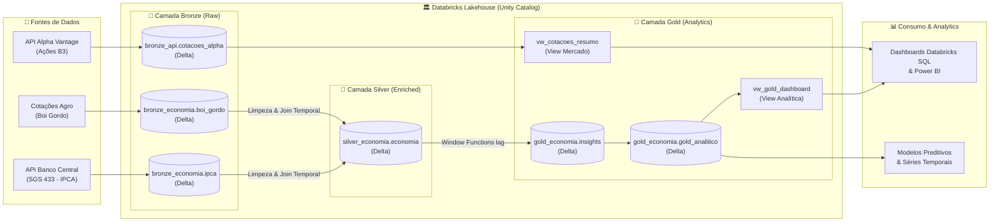

<div align="center">

# 🏛️ Modern Data Lakehouse com Databricks & Delta Lake
### *Engenharia de Dados de Alta Performance, Arquitetura Medalhão e Governança com Unity Catalog*

[](https://databricks.com)
[](https://spark.apache.org)
[](https://delta.io)
[](https://python.org)
[](https://github.com)

<br>

<p align="center">
  <b>Pipeline de Engenharia de Dados ponta a ponta integrando fontes públicas e financeiras (Banco Central do Brasil e Alpha Vantage), modelagem Medalhão (Bronze ➔ Silver ➔ Gold), técnicas avançadas de otimização no Spark (Z-ORDER, OPTIMIZE, Broadcast Joins) e governança centralizada no Unity Catalog.</b>
</p>

</div>

---

## 📑 Índice
- [Visão Geral do Projeto](#-visão-geral-do-projeto)
- [Arquitetura da Solução](#-arquitetura-da-solução)
- [Camadas do Lakehouse (Arquitetura Medalhão)](#-camadas-do-lakehouse-arquitetura-medalhão)
- [Engenharia de Performance & Otimizações Spark](#-engenharia-de-performance--otimizações-spark)
- [Estrutura do Repositório](#-estrutura-do-repositório)
- [Como Executar o Projeto](#-como-executar-o-projeto)
- [Dicionário de Dados & Guia de Entrevistas](#-documentação-complementar)
- [Autor](#-autor)

---

## 🎯 Visão Geral do Projeto

Este projeto foi desenvolvido para demonstrar a aplicação prática e profissional dos pilares modernos da **Engenharia de Dados**, resolvendo os desafios clássicos de arquiteturas tradicionais (silos, falta de governança, redundância e o problema de pequenos arquivos).

### 💡 Casos de Uso Implementados:
1. **Pipeline Macroeconômico & Agropecuário:**
   - Ingestão contínua da taxa de inflação oficial (**IPCA** - Banco Central do Brasil) via API REST.
   - Cruzamento temporal com a cotação histórica da **Arroba do Boi Gordo**.
   - Geração de métricas avançadas via **Window Functions** (`F.lag()`) para detectar correlação e divergências de mercado entre inflação e commodities agrícolas.
2. **Pipeline de Mercado de Capitais (B3):**
   - Ingestão resiliente de séries temporais diárias para ativos de alta liquidez da bolsa brasileira (`PETR4`, `VALE3`, `ITUB4`, `BBDC4`, `ABEV3`) via **Alpha Vantage API**.
   - Modelagem de Views de consumo executivo com agregações em tempo real.

---

## 🏗️ Arquitetura da Solução



---

## 🏅 Camadas do Lakehouse (Arquitetura Medalhão)

### 🥉 1. Camada Bronze (Ingestão Bruta & Linhagem)
- **Propósito:** Armazenamento imutável dos dados crus (*raw data*), preservando o estado de origem.
- **Boas Práticas Aplicadas:** Nenhuma regra de negócio é aplicada. Inclusão de metadados de auditoria (`data_coleta`, `data_ingestao`) para suportar reprocessamento histórico (*Time Travel / Idempotência*).

### 🥈 2. Camada Silver (Qualidade, Tipagem & Joins)
- **Propósito:** Dados limpos, consistentes e conformados.
- **Transformações PySpark:**
  - Padronização de múltiplos formatos de data (`dd/MM/yyyy` e `MM/yyyy`) para a competência canônica `yyyy-MM-01`.
  - Tratamento de casas decimais e casting estrito para `DoubleType`.
  - *Inner Join* temporal correlacionando indicadores macroeconômicos e o setor agropecuário.

### 🥇 3. Camada Gold (Inteligência & Agregações de Negócio)
- **Propósito:** Dados agregados e modelados para alto desempenho analítico.
- **Regras de Negócio Implementadas:**
  - Uso de **Window Functions** (`Window.orderBy("data")` com `F.lag()`) para cálculo da taxa de variação mensal percentual ($\Delta\%$).
  - Categorização automática de cenários (*"Preço do boi cresce mais"*, *"Inflação cresce mais"*).
  - Classificação de divergência absoluta entre a inflação e a commodity (Alta, Média ou Baixa).

---

## ⚡ Engenharia de Performance & Otimizações Spark

| Técnica | Por que foi utilizada? | Como funciona na prática? |
| :--- | :--- | :--- |
| **Delta OPTIMIZE** | Mitigação do *Small File Problem* gerado por ingestões contínuas de APIs. | Compacta múltiplos arquivos pequenos Parquet em arquivos consolidados de ~1GB via *bin-packing*. |
| **Z-ORDER Clustering** | Aceleração de consultas filtradas por múltiplas dimensões (`ticker`, `data`). | Organiza os dados em curvas de Hilbert multidimensionais, permitindo que o Spark pule blocos inteiros (*Data Skipping*). |
| **Broadcast Hash Join** | Otimização de junção entre tabelas fato e tabelas dimensão pequenas. | A diretiva `/*+ BROADCAST(p) */` envia uma cópia da tabela menor diretamente para a memória de cada executor, eliminando o *Shuffle* na rede. |
| **Delta Auto Optimize** | Automação da saúde do storage durante pipelines contínuos de escrita. | Habilita `optimizeWrite` e `autoCompact` nas propriedades da tabela Delta. |
| **Cost-Based Optimizer (CBO)** | Fornece estatísticas de cardinalidade ao Catalyst Optimizer do Spark. | Execução de `ANALYZE TABLE ... COMPUTE STATISTICS` para planejamento ótimo de execução de queries. |

---

## 📂 Estrutura do Repositório

```text
databricks-lakehouse-pipeline/
├── ci/
│   └── ci.yml                             # CI/CD: Pipeline de Testes Automatizados (PyTest)
├── docs/
│   ├── architecture.md                    # Detalhamento profundo de arquitetura e decisões
│   ├── data_dictionary.md                 # Dicionário completo de tabelas e colunas
│   └── interview_guide.md                 # Guia técnico preparatório para entrevistas
├── notebooks/
│   ├── 01_ingestao_api_mercado.ipynb      # Notebook Databricks: Ingestão Alpha Vantage
│   ├── 02_arquitetura_medalhao.ipynb      # Notebook Databricks: Pipeline Medalhão Completo
│   └── 03_otimizacoes_delta_spark.ipynb   # Notebook Databricks: Z-ORDER, OPTIMIZE e Joins
├── src/
│   ├── config.py                          # Configurações dinâmicas (Local Spark vs Databricks UC)
│   ├── ingestion_bcb.py                   # Ingestão API do Banco Central (IPCA) e Boi Gordo
│   ├── ingestion_alpha.py                 # Ingestão API Alpha Vantage (Ações B3)
│   ├── silver_transformations.py          # Limpeza, tipagem e join temporal na Silver
│   ├── gold_analytics.py                  # Window functions e regras de negócio na Gold
│   └── pipeline_runner.py                 # Orquestrador de execução ponta a ponta
├── sql/
│   ├── 01_create_schemas.sql              # DDL de schemas e tabelas Delta (Unity Catalog)
│   ├── 02_views_and_analytics.sql         # Views analíticas para Dashboards/BI
│   └── 03_optimizations_and_tuning.sql    # Scripts de tuning (OPTIMIZE, Z-ORDER, CBO)
├── tests/
│   └── test_transformations.py            # Testes unitários com PyTest
├── .env.example                           # Modelo de variáveis de ambiente
├── .gitignore                             # Filtro de arquivos sensíveis e temporários
├── requirements.txt                       # Dependências do projeto
└── README.md                              # Documentação principal
```

---

## 🚀 Como Executar o Projeto

### Opção 1: Execução Local (Python + PySpark + Delta Lake)

1. **Clone o repositório:**
   ```bash
   git clone https://github.com/SEU_USUARIO/databricks-lakehouse-pipeline.git
   cd databricks-lakehouse-pipeline
   ```

2. **Crie e ative um ambiente virtual:**
   ```bash
   python3 -m venv venv
   source venv/bin/activate  # Linux/macOS
   # ou: venv\Scripts\activate  # Windows
   ```

3. **Instale as dependências:**
   ```bash
   pip install -r requirements.txt
   ```

4. **Configure suas variáveis de ambiente:**
   ```bash
   cp .env.example .env
   # Edite o arquivo .env com sua chave da Alpha Vantage (ou deixe o padrão para dados simulados)
   ```

5. **Execute os testes unitários:**
   ```bash
   pytest tests/ -v
   ```

6. **Execute o pipeline completo:**
   ```bash
   python -m src.pipeline_runner
   ```

---

### Opção 2: Execução no Databricks (Community Edition ou Cloud)

1. Acesse o **Databricks Workspace**.
2. Vá em **Workspace ➔ Users ➔ Seu Usuário ➔ Import**.
3. Importe os notebooks contidos na pasta `notebooks/`.
4. Execute na ordem:
   - `01_ingestao_api_mercado.ipynb`
   - `02_arquitetura_medalhao.ipynb`
   - `03_otimizacoes_delta_spark.ipynb`

---

## 📚 Documentação Complementar

- 📘 [**Arquitetura Detalhada & Decisões Técnicas**](docs/architecture.md)
- 📖 [**Dicionário de Dados Completo**](docs/data_dictionary.md)
- 🎯 [**Guia de Entrevistas: Como Defender este Projeto**](docs/interview_guide.md)

---

## 👨‍💻 Autor

Desenvolvido por **Cesar** como projeto de portfólio para Pós-Graduação em Engenharia de Dados / Databricks.

[](https://linkedin.com)
[](https://github.com)
